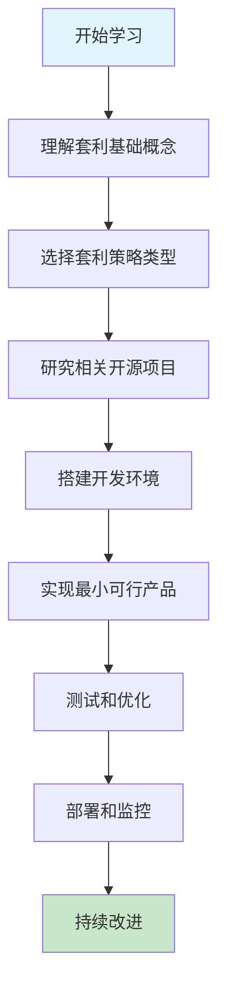

# Solana 套利 (Arbitrage) 资源大全

## 🌟 概述

欢迎来到 Solana 套利资源大全！本章节收集了所有与 Solana 生态系统中套利交易相关的开源项目、教程文章、工具基础设施和策略分析。

### 什么是套利交易？

套利交易是指利用不同市场或交易对之间的价格差异来获取无风险或低风险利润的交易策略。在 Solana 生态系统中，套利机会主要来源于：

- **DEX 间价格差异**: 不同去中心化交易所之间的价格不一致
- **CEX-DEX 价格差**: 中心化交易所与去中心化交易所之间的价格差
- **三角套利**: 三个相关交易对之间的价格循环机会
- **清算套利**: 借贷协议中的清算机会
- **Memecoin 发射狙击**: 新代币发行时的早期进入机会

## 📚 资源分类

### [🔧 GitHub 开源项目](./github-projects.md)
- **DEX 套利机器人**: 跨 DEX 自动化套利工具
- **闪电贷实现**: 利用闪电贷放大套利收益
- **Pump.fun 狙击机器人**: Memecoin 发行狙击工具
- **清算机器人**: 借贷协议清算自动化
- **MEV 机器人**: 最大可提取价值相关工具

### [📖 教程和文章](./tutorials-articles.md)
- **技术深度分析**: MEV、三角套利、跨链套利
- **实战教程**: 从零开始构建套利机器人
- **市场分析**: 套利机会识别和市场动态
- **案例研究**: 实际套利交易案例分析

### [⚡ 策略分类](./strategies.md)
- **三角套利**: 同一交易所内三个交易对的循环套利
- **跨 DEX 套利**: 不同 DEX 之间的价格差套利
- **CEX-DEX 套利**: 中心化与去中心化交易所套利
- **闪电贷套利**: 零资本套利策略
- **清算套利**: 借贷协议清算机会
- **统计套利**: 基于历史数据的量化策略

### [🛠️ 工具和基础设施](./tools-infrastructure.md)
- **RPC 节点服务**: 高性能区块链连接
- **MEV 保护服务**: Jito、0slot 等交易加速服务
- **监控分析工具**: 价格监控和机会发现
- **开发框架**: 套利机器人开发工具包
- **性能优化**: 延迟优化和执行效率提升

### [⚠️ 风险提示](./risk-disclaimer.md)
- **交易风险**: 套利交易的潜在损失
- **技术风险**: 代码漏洞和系统故障
- **市场风险**: 价格滑点和流动性风险
- **监管风险**: 法律合规考虑
- **最佳实践**: 风险管理建议

## 🚀 快速开始

### 新手入门
1. 阅读 [策略分类](./strategies.md) 了解不同套利类型
2. 查看 [教程文章](./tutorials-articles.md) 学习基础知识
3. 研究 [GitHub 项目](./github-projects.md) 寻找合适的起点
4. **重要**: 仔细阅读 [风险提示](./risk-disclaimer.md)

### 开发者路径
1. 选择合适的技术栈（Rust、TypeScript、Python）
2. 配置高性能 RPC 节点
3. 选择目标 DEX 和交易对
4. 实现价格监控和机会检测
5. 开发执行引擎和风险控制
6. 进行充分测试和优化

### 推荐学习路径

## 📊 生态系统统计

### 主要 DEX 支持
- **Raydium**: 最大 AMM DEX，流动性丰富
- **Orca**: 高效 CLMM 实现，低滑点
- **Jupiter**: DEX 聚合器，最优路径
- **Meteora**: 多策略流动性池
- **Serum**: 中央限价订单簿

### 技术栈分布
- **Rust**: 高性能链上程序，最低延迟
- **TypeScript/JavaScript**: 快速原型开发，丰富生态
- **Python**: 数据分析和算法策略
- **Go**: 高并发处理和网络优化

### 热门策略占比
1. **跨 DEX 套利** (40%): 最常见和稳定的策略
2. **三角套利** (25%): 复杂但收益率高
3. **清算套利** (15%): 风险低但需要资金
4. **Pump.fun 狙击** (12%): 高风险高收益
5. **其他策略** (8%): 创新和实验性策略

## 🎯 成功案例

### 知名项目成果
- **Jito MEV 机器人**: 月处理量超 100M USDC
- **ARB Protocol**: 开源社区贡献超 1000+ stars
- **Solend 清算器**: 清算总价值超 50M USD
- **Pump.fun 狙击器**: 成功率 60%+ 的早期进入

### 性能基准
- **最优延迟**: < 100ms 交易执行
- **成功率**: 头部机器人 80%+ 套利成功
- **资金利用率**: 15%+ 年化收益率
- **风险控制**: 最大回撤 < 5%

## 🤝 社区贡献

### 贡献指南
欢迎社区成员贡献优质资源：

1. **提交新项目**: 发现优秀开源项目
2. **分享教程**: 贡献学习资料和案例
3. **报告更新**: 维护链接有效性
4. **改进文档**: 优化内容质量和结构

### 提交标准
- 项目必须与 Solana 套利相关
- 开源项目需要有完整文档
- 教程文章需要有实际价值
- 所有链接需要保持有效

## ⭐ 推荐资源

### 必读项目
1. **[Jito MEV Bot](https://github.com/jito-labs/mev-bot)** - 官方 MEV 机器人参考实现
2. **[ARB Protocol V2](https://github.com/ARBProtocol/ARB-V2)** - 功能完整的套利机器人
3. **[Buffalo Joe's Arb Program](https://github.com/buffalojoec/arb-program)** - 链上套利程序示例

### 精选教程
1. **[EigenPhi 三角套利分析](https://eigenphi.substack.com/p/solanas-triangular-arbitrage-explored)** - 深度技术分析
2. **[Solana MEV Cookbook](https://misaka.substack.com/p/mev-on-solana-cookbook-arbitrage)** - 实战指南
3. **[Chainstack Pump.fun 教程](https://docs.chainstack.com/docs/solana-creating-a-pumpfun-bot)** - 狙击机器人教程

## 📱 联系方式

如有问题或建议，欢迎通过以下方式联系：

- **GitHub Issues**: 在对应项目提交问题
- **Discord 社区**: 加入 Solana 开发者社区
- **Telegram 群组**: 技术讨论和经验分享

---

**免责声明**: 套利交易存在重大风险，包括但不限于资金损失、技术故障、市场波动等。请在充分了解风险后谨慎参与。本资源仅供学习和研究使用。

**最后更新**: 2025年1月