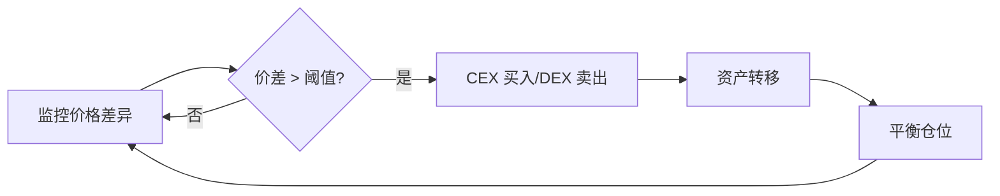

# 套利策略分类详解

## 🔺 三角套利 (Triangular Arbitrage)

### 策略概述
三角套利利用同一交易所内三个相关交易对之间的价格差异来获取无风险利润。通过循环交易三种资产，最终获得比初始投入更多的基础资产。

### 基本原理
```
初始资产: SOL
路径: SOL → USDC → BONK → SOL
目标: 获得比初始更多的 SOL
```

### 实际案例分析
基于 EigenPhi 对 Solana 块 237321932 的分析：

**交易对组合**: SOL/USDC, BONK/USDC, BONK/SOL
**执行步骤**:
1. 使用 SOL 在 Raydium 购买 USDC
2. 使用 USDC 在 Orca 购买 BONK  
3. 使用 BONK 在 Jupiter 换回 SOL
4. 最终获得超过初始投入的 SOL 数量

### 技术实现要点
```typescript
interface TriangularArbitrageDetector {
  // 价格获取
  async getPrices(): Promise<PriceMatrix> {
    const prices = {
      SOL_USDC: await this.getPrice('Raydium', 'SOL/USDC'),
      BONK_USDC: await this.getPrice('Orca', 'BONK/USDC'),  
      BONK_SOL: await this.getPrice('Jupiter', 'BONK/SOL')
    };
    return prices;
  }
  
  // 机会检测
  detectOpportunity(prices: PriceMatrix): ArbitrageOpportunity | null {
    const route1 = 1 / prices.SOL_USDC * prices.BONK_USDC / prices.BONK_SOL;
    const route2 = prices.BONK_SOL / prices.BONK_USDC * prices.SOL_USDC;
    
    if (route1 > 1.005) { // 0.5% 最低利润阈值
      return {
        direction: 'SOL→USDC→BONK→SOL',
        profitRate: (route1 - 1) * 100,
        optimalAmount: this.calculateOptimalAmount(prices, route1)
      };
    }
    
    return null;
  }
}
```

### 优势与挑战
**优势**:
- 单一交易所执行，减少跨平台风险
- 原子性执行，要么全成功要么全失败
- Solana 400ms 出块时间提供快速确认

**挑战**:
- 需要精确的价格监控和快速执行
- 滑点可能消除利润空间
- 高频竞争激烈

### 适用 DEX
- **Raydium**: 流动性最充足的 AMM
- **Orca**: CLMM 提供更好的价格执行
- **Jupiter**: 自动找到最优路径
- **Meteora**: 多策略池提供不同价格

---

## ↔️ 跨 DEX 套利 (Cross-DEX Arbitrage)

### 策略概述
跨 DEX 套利利用不同去中心化交易所之间相同交易对的价格差异，在价格较低的 DEX 买入，在价格较高的 DEX 卖出。

### 基本机制
```
发现: TokenA 在 Raydium 价格为 $10, 在 Orca 价格为 $10.2
执行: 在 Raydium 买入 TokenA, 在 Orca 卖出 TokenA
利润: $0.2 每个 Token (减去交易费用和滑点)
```

### 技术架构
```typescript
class CrossDEXArbitrage {
  private dexClients: Map<string, DEXClient> = new Map();
  
  constructor() {
    this.dexClients.set('raydium', new RaydiumClient());
    this.dexClients.set('orca', new OrcaClient());
    this.dexClients.set('meteora', new MeteoraClient());
  }
  
  // 价格监控
  async monitorPrices(tokenPair: string): Promise<void> {
    const priceFeeds = Array.from(this.dexClients.entries()).map(
      async ([dexName, client]) => ({
        dex: dexName,
        price: await client.getPrice(tokenPair),
        liquidity: await client.getLiquidity(tokenPair)
      })
    );
    
    const prices = await Promise.all(priceFeeds);
    const opportunity = this.findArbitrageOpportunity(prices);
    
    if (opportunity) {
      await this.executeArbitrage(opportunity);
    }
  }
  
  // 机会识别
  findArbitrageOpportunity(prices: PriceData[]): ArbitrageOpp | null {
    prices.sort((a, b) => a.price - b.price);
    const cheapest = prices[0];
    const expensive = prices[prices.length - 1];
    
    const spreadPercent = (expensive.price - cheapest.price) / cheapest.price;
    
    if (spreadPercent > 0.008) { // 0.8% 最小利润要求
      return {
        buyDEX: cheapest.dex,
        sellDEX: expensive.dex,
        token: tokenPair,
        profit: spreadPercent,
        maxAmount: Math.min(cheapest.liquidity, expensive.liquidity) * 0.1
      };
    }
    
    return null;
  }
}
```

### 执行策略
**并行执行**:
```typescript
async executeParallelArbitrage(opportunity: ArbitrageOpp): Promise<void> {
  const buyPromise = this.dexClients.get(opportunity.buyDEX)
    .buy(opportunity.token, opportunity.maxAmount);
    
  const sellPromise = this.dexClients.get(opportunity.sellDEX)  
    .sell(opportunity.token, opportunity.maxAmount);
    
  // 并行执行以减少价格滑移风险
  await Promise.all([buyPromise, sellPromise]);
}
```

### 热门交易对
1. **SOL/USDC**: 流动性最高，价格差异相对稳定
2. **RAY/USDC**: Raydium 原生代币，各 DEX 价格差异明显
3. **ORCA/USDC**: Orca 原生代币，类似情况
4. **mSOL/SOL**: 流动性质押代币，价格发现差异

### 风险因素
- **执行延迟**: 两笔交易之间的价格变动
- **滑点影响**: 大额交易对价格的冲击
- **Gas 费用**: 两次交易的累计成本
- **流动性不足**: 无法执行预期交易量

---

## 🔄 CEX-DEX 套利 (CEX-DEX Arbitrage)

### 策略概述
CEX-DEX 套利利用中心化交易所(CEX)和去中心化交易所(DEX)之间的价格差异，通过跨平台交易获取利润。

### 执行流程


### 技术集成
```typescript
class CEXDEXArbitrage {
  private cexAPI: BinanceAPI;
  private dexClients: Map<string, DEXClient>;
  
  // 价格监控
  async monitorCEXDEXSpread(symbol: string): Promise<void> {
    const [cexPrice, dexPrices] = await Promise.all([
      this.cexAPI.getPrice(symbol),
      this.getAllDEXPrices(symbol)
    ]);
    
    for (const [dexName, dexPrice] of dexPrices) {
      const spread = Math.abs(cexPrice - dexPrice) / Math.min(cexPrice, dexPrice);
      
      if (spread > 0.015) { // 1.5% 最小价差
        await this.executeCEXDEXArbitrage({
          symbol,
          cexPrice,
          dexPrice,
          dexName,
          direction: cexPrice < dexPrice ? 'CEX_BUY_DEX_SELL' : 'CEX_SELL_DEX_BUY'
        });
      }
    }
  }
  
  // 执行套利
  async executeCEXDEXArbitrage(opportunity: CEXDEXOpportunity): Promise<void> {
    if (opportunity.direction === 'CEX_BUY_DEX_SELL') {
      // CEX 买入，DEX 卖出
      const buyOrder = await this.cexAPI.marketBuy(opportunity.symbol, amount);
      const sellTx = await this.dexClients.get(opportunity.dexName)
        .sell(opportunity.symbol, amount);
    } else {
      // DEX 买入，CEX 卖出  
      const buyTx = await this.dexClients.get(opportunity.dexName)
        .buy(opportunity.symbol, amount);
      const sellOrder = await this.cexAPI.marketSell(opportunity.symbol, amount);
    }
  }
}
```

### 支持的 CEX 平台
1. **Binance**: 全球最大交易量，API 成熟
2. **OKX**: 支持 Solana 生态，快速充提
3. **FTX** (已关闭): 曾经的 Solana 深度集成
4. **Coinbase**: 合规性强，价格发现权威

### 主要挑战
**资金转移延迟**:
- CEX 提现到钱包: 5-30 分钟
- 钱包充值到 CEX: 1-5 分钟  
- 链上确认时间: 400ms per block

**解决方案**:
```typescript
// 预充值策略
class BalanceManager {
  async maintainBalance(): Promise<void> {
    const cexBalance = await this.cexAPI.getBalance();
    const dexBalance = await this.getWalletBalance();
    
    // 保持两边都有足够资金进行套利
    const targetRatio = 0.5; // 50%-50% 分配
    
    if (cexBalance / (cexBalance + dexBalance) < 0.3) {
      await this.transferFromDEXToCEX();
    } else if (cexBalance / (cexBalance + dexBalance) > 0.7) {
      await this.transferFromCEXToDEX();
    }
  }
}
```

---

## ⚡ 闪电贷套利 (Flash Loan Arbitrage)

### 策略概述
闪电贷套利利用闪电贷的零抵押特性，在单笔交易内借出大额资金执行套利操作，最后偿还贷款并获取利润。

### 执行原理
```
1. 闪电贷借出 100,000 USDC
2. 使用 USDC 在 DEX A 买入 TokenX  
3. 将 TokenX 在 DEX B 高价卖出获得更多 USDC
4. 偿还闪电贷本金 + 利息
5. 剩余 USDC 即为利润
```

### Solana 闪电贷协议
**Solend Protocol**:
```typescript
// 使用 Solend 闪电贷
async executeFlashLoanArbitrage(
  loanAmount: number,
  arbLogic: ArbitrageLogic
): Promise<void> {
  const flashLoanIx = await solend.createFlashLoanInstruction({
    amount: loanAmount,
    reserve: 'USDC',
    // 套利逻辑将在闪电贷内执行
    instructions: await arbLogic.buildInstructions()
  });
  
  const tx = new Transaction().add(flashLoanIx);
  await sendAndConfirmTransaction(connection, tx, [wallet]);
}
```

**Solaris Protocol**:
```typescript
// Solaris 闪电贷 + 套利集成
class SolarisFlashArb {
  async executeArbitrage(opportunity: FlashArbOpp): Promise<void> {
    // 检查盈利性：liquidation_reward > flashloan_fee
    const estimatedProfit = opportunity.expectedReturn - opportunity.flashLoanFee;
    
    if (estimatedProfit > this.minProfitThreshold) {
      await this.solaris.flashLoan({
        amount: opportunity.loanAmount,
        asset: opportunity.asset,
        callback: async (loanedFunds) => {
          // 执行套利逻辑
          return await this.executeArbitrageLogic(loanedFunds, opportunity);
        }
      });
    }
  }
}
```

### 风险控制
```typescript
class FlashLoanRiskManager {
  // 预执行验证
  async simulateFlashLoanArbitrage(params: FlashLoanParams): Promise<SimResult> {
    const simulation = await connection.simulateTransaction(
      this.buildFlashLoanTransaction(params),
      { commitment: 'processed' }
    );
    
    return {
      wouldSucceed: !simulation.value.err,
      estimatedProfit: this.calculateProfit(simulation),
      gasUsed: simulation.value.unitsConsumed
    };
  }
  
  // 滑点保护
  validateSlippage(expectedOutput: number, actualOutput: number): boolean {
    const slippage = Math.abs(expectedOutput - actualOutput) / expectedOutput;
    return slippage < this.maxSlippageTolerance; // 例如 2%
  }
}
```

### 适用场景
1. **大额套利**: 闪电贷放大套利规模
2. **短期价格差异**: 快速响应市场不平衡
3. **清算套利**: 配合借贷协议清算
4. **复杂多步策略**: 一个交易内执行多个步骤

---

## 🧹 清算套利 (Liquidation Arbitrage)

### 策略概述
清算套利通过监控借贷协议中的不健康仓位，在触发清算条件时执行清算操作获取清算奖励。

### 借贷协议清算机制
**Solend Protocol**:
- 清算奖励: 5-20% 奖金
- 触发条件: 抵押率低于清算阈值
- 执行方式: 偿还部分债务，获得折价抵押品

**实现示例**:
```typescript
class SolendLiquidator {
  async monitorPositions(): Promise<void> {
    const obligations = await this.solend.getAllObligations();
    
    for (const obligation of obligations) {
      const healthFactor = await this.calculateHealthFactor(obligation);
      
      if (healthFactor < 1.0) { // 可清算
        const liquidationReward = await this.calculateLiquidationReward(obligation);
        const flashLoanCost = this.estimateFlashLoanCost(obligation.debt);
        
        if (liquidationReward > flashLoanCost * 1.2) { // 20% 最小利润
          await this.executeLiquidation(obligation);
        }
      }
    }
  }
  
  async executeLiquidation(obligation: Obligation): Promise<void> {
    // 使用闪电贷获取清算资金
    await this.flashLoan({
      amount: obligation.debt,
      callback: async (funds) => {
        // 偿还债务
        await this.solend.repay(obligation, funds);
        
        // 获取折价抵押品
        const collateral = await this.solend.liquidateCollateral(obligation);
        
        // 在市场上卖出抵押品
        const proceeds = await this.sellCollateral(collateral);
        
        // 偿还闪电贷并保留利润
        return proceeds - obligation.debt;
      }
    });
  }
}
```

### Drift Protocol 清算
```typescript
class DriftLiquidator {
  // 基于保证金比率的用户分桶
  prioritizeUsers(users: DriftUser[]): PrioritizedBuckets {
    return {
      highPriority: users.filter(u => u.marginRatio < 0.05), // < 5%
      mediumPriority: users.filter(u => u.marginRatio < 0.08), // < 8%  
      lowPriority: users.filter(u => u.marginRatio < 0.10) // < 10%
    };
  }
  
  // 前跑清算防止延迟
  async frontrunLiquidation(user: DriftUser): Promise<void> {
    // 在用户实际可清算前发送交易，考虑延迟
    const futureMarginRatio = this.predictMarginRatio(user, 2); // 2秒后
    
    if (futureMarginRatio < 1.0) {
      await this.sendLiquidationTx(user, { 
        sendToTPU: true, // 直接发送到 TPU Leaders
        priority: 'high'
      });
    }
  }
}
```

### 清算机器人性能优化
```typescript
class LiquidationOptimizer {
  // TPU 直连优化
  private tpuClient: TpuClient;
  
  async optimizeLiquidationExecution(): Promise<void> {
    // 获取当前和未来的 TPU leader 信息
    const leaders = await this.tpuClient.getLeaderSchedule();
    
    // 直接发送到 TPU 以获得最佳执行概率
    await this.tpuClient.sendTransaction(liquidationTx, {
      skipPreflight: true,
      maxRetries: 3
    });
  }
  
  // 批量清算优化
  async batchLiquidations(opportunities: LiquidationOpp[]): Promise<void> {
    // 按照盈利性排序
    opportunities.sort((a, b) => b.profit - a.profit);
    
    // 批量执行高价值清算
    const batch = opportunities.slice(0, 5); // 最多5个并行
    await Promise.all(batch.map(opp => this.executeLiquidation(opp)));
  }
}
```

---

## 🎯 Memecoin 发射狙击 (Memecoin Launch Sniping)

### 策略概述
Memecoin 狙击策略专注于在新代币发射的早期阶段快速买入，利用初期流动性不足和价格发现过程中的机会获取利润。

### Pump.fun 狙击机制
**平台特点**:
- 绑定曲线价格机制
- 初期流动性由平台提供
- 到达一定市值后转移到 DEX

**狙击策略**:
```typescript
class PumpFunSniper {
  // 新币监控
  async monitorNewLaunches(): Promise<void> {
    const newTokens = await this.pumpFun.getRecentLaunches();
    
    for (const token of newTokens) {
      const analysis = await this.analyzeToken(token);
      
      if (this.shouldSnipe(analysis)) {
        await this.executeFastBuy(token, analysis.optimalAmount);
      }
    }
  }
  
  // 代币分析
  async analyzeToken(token: NewToken): Promise<TokenAnalysis> {
    return {
      bondingCurveProgress: token.bondingCurve.progress,
      initialLiquidity: token.bondingCurve.liquidity,
      creatorWallet: token.creator,
      socialSignals: await this.analyzeSocialSignals(token),
      technicalScore: this.calculateTechnicalScore(token)
    };
  }
  
  // 快速购买执行
  async executeFastBuy(token: NewToken, amount: number): Promise<void> {
    const buyTx = await this.pumpFun.createBuyTransaction({
      tokenAddress: token.address,
      amount: amount,
      slippage: 0.15, // 15% 滑点容忍度
      priorityFee: 0.001 // 高优先费
    });
    
    // 使用高性能 RPC 快速提交
    await this.submitWithHighPriority(buyTx);
  }
}
```

### 利润获取策略
```typescript
class ProfitTakingStrategy {
  // 阶梯式获利
  async executeTieredProfitTaking(position: Position): Promise<void> {
    const currentPrice = await this.getCurrentPrice(position.token);
    const priceChange = (currentPrice - position.entryPrice) / position.entryPrice;
    
    if (priceChange > 0.25) { // 25% 利润
      await this.sell(position.token, position.amount * 0.5); // 卖出 50%
    }
    
    if (priceChange > 0.50) { // 50% 利润  
      await this.sell(position.token, position.amount * 0.75); // 再卖出 75%
    }
    
    if (priceChange > 1.0) { // 100% 利润
      await this.sell(position.token, position.amount); // 全部卖出
    }
  }
  
  // 止损机制
  async monitorStopLoss(position: Position): Promise<void> {
    const currentPrice = await this.getCurrentPrice(position.token);
    const loss = (position.entryPrice - currentPrice) / position.entryPrice;
    
    if (loss > 0.3) { // 30% 止损
      await this.sell(position.token, position.amount);
    }
  }
}
```

### 风险管理
```typescript
class SnipingRiskManager {
  // 资金管理
  calculatePositionSize(
    accountBalance: number, 
    tokenRisk: RiskLevel
  ): number {
    const riskPercentage = {
      low: 0.05,    // 5% 资金
      medium: 0.03, // 3% 资金  
      high: 0.01    // 1% 资金
    };
    
    return accountBalance * riskPercentage[tokenRisk];
  }
  
  // 多样化投资
  async diversifyAcrossLaunches(): Promise<void> {
    const dailyBudget = this.getDailyBudget();
    const maxPositionsPerDay = 20;
    const maxPositionSize = dailyBudget / maxPositionsPerDay;
    
    // 分散投资多个新发射的代币
    // 降低单一代币失败的影响
  }
}
```

---

## 📊 统计套利 (Statistical Arbitrage)

### 策略概述
统计套利利用历史数据分析和数学模型，识别价格偏离正常关系的情况，通过均值回归等统计规律获取利润。

### 配对交易策略
```typescript
class PairsTrading {
  // 寻找相关性强的交易对
  async findCorrelatedPairs(tokens: string[]): Promise<TokenPair[]> {
    const priceHistory = await this.getHistoricalPrices(tokens, '30d');
    const correlationMatrix = this.calculateCorrelationMatrix(priceHistory);
    
    const pairs = [];
    for (let i = 0; i < tokens.length; i++) {
      for (let j = i + 1; j < tokens.length; j++) {
        const correlation = correlationMatrix[i][j];
        if (correlation > 0.8) { // 80% 以上相关性
          pairs.push({
            tokenA: tokens[i],
            tokenB: tokens[j], 
            correlation: correlation,
            spreadHistory: this.calculateSpreadHistory(tokens[i], tokens[j])
          });
        }
      }
    }
    
    return pairs;
  }
  
  // 价差交易
  async executeSpreadTrading(pair: TokenPair): Promise<void> {
    const currentSpread = await this.getCurrentSpread(pair.tokenA, pair.tokenB);
    const { mean, stdDev } = this.calculateSpreadStats(pair.spreadHistory);
    
    const zScore = (currentSpread - mean) / stdDev;
    
    if (zScore > 2) { // 价差过高，做空价差
      await this.sellToken(pair.tokenA); // 卖出高价代币
      await this.buyToken(pair.tokenB);  // 买入低价代币
    } else if (zScore < -2) { // 价差过低，做多价差
      await this.buyToken(pair.tokenA);  // 买入被低估代币
      await this.sellToken(pair.tokenB); // 卖出被高估代币
    }
  }
}
```

### 均值回归策略
```typescript
class MeanReversionStrategy {
  // 布林带策略
  async bollingerBandStrategy(token: string): Promise<void> {
    const prices = await this.getRecentPrices(token, 20); // 20 期价格
    const sma = this.calculateSMA(prices);
    const stdDev = this.calculateStandardDeviation(prices);
    
    const upperBand = sma + (2 * stdDev);
    const lowerBand = sma - (2 * stdDev);
    const currentPrice = prices[prices.length - 1];
    
    if (currentPrice > upperBand) {
      await this.sellToken(token); // 价格过高，卖出
    } else if (currentPrice < lowerBand) {
      await this.buyToken(token);  // 价格过低，买入
    }
  }
  
  // RSI 策略
  async rsiStrategy(token: string): Promise<void> {
    const rsi = await this.calculateRSI(token, 14);
    
    if (rsi > 70) { // 超买
      await this.sellToken(token);
    } else if (rsi < 30) { // 超卖
      await this.buyToken(token);
    }
  }
}
```

---

## 🎖️ 策略性能对比

### 收益率分析
| 策略类型 | 平均年化收益 | 风险等级 | 资金要求 | 技术难度 |
|---------|-------------|---------|----------|----------|
| 三角套利 | 15-30% | 中等 | 中等 | 高 |
| 跨DEX套利 | 20-40% | 中高 | 低 | 中高 |
| CEX-DEX套利 | 10-25% | 中等 | 高 | 中等 |
| 闪电贷套利 | 25-50% | 高 | 低 | 高 |
| 清算套利 | 12-25% | 低 | 中等 | 中高 |
| Memecoin狙击 | 50-200% | 极高 | 低 | 中等 |
| 统计套利 | 8-20% | 低 | 高 | 高 |

### 策略组合建议
```typescript
// 多策略投资组合
const STRATEGY_ALLOCATION = {
  // 稳健策略 (60%)
  stable: {
    crossDEX: 0.25,      // 25% 跨DEX套利
    liquidation: 0.20,   // 20% 清算套利
    statistical: 0.15    // 15% 统计套利
  },
  
  // 增长策略 (30%)  
  growth: {
    triangular: 0.15,    // 15% 三角套利
    flashLoan: 0.15      // 15% 闪电贷套利
  },
  
  // 投机策略 (10%)
  speculative: {
    memecoinSniping: 0.10 // 10% Memecoin狙击
  }
};
```

---

**💡 策略选择建议**:
1. **新手**: 从跨DEX套利开始，风险相对可控
2. **进阶**: 学习三角套利和闪电贷套利
3. **专业**: 开发统计套利模型和清算机器人
4. **投机**: 适量参与Memecoin狙击，严格控制仓位

**最后更新**: 2025年1月