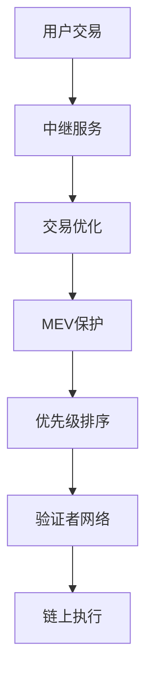

# Solana 交易中继服务

## 🌐 服务概述

交易中继服务是连接用户交易与Solana网络的重要基础设施，提供交易优化、MEV保护、优先级管理等功能。

## 🔄 主要中继服务类型

### MEV中继器
- **Jito中继器**: 200毫秒延迟保护，捆绑原子执行
- **bloXroute中继器**: BDN网络加速，多种执行模式
- **私有中继器**: 定制化MEV保护和路由

### 优先级中继器
- **高优先级路由**: 确保重要交易快速处理
- **动态费用调整**: 基于网络拥堵自动调整
- **批量处理**: 优化gas使用效率

### 专用中继器
- **DeFi协议专用**: 针对特定协议优化
- **机构级服务**: 大额交易专用通道
- **开发者工具**: API和SDK集成

## 🛠️ 技术架构

### 中继机制


### 关键组件
- **交易接收器**: 接收和验证用户交易
- **优化引擎**: 分析和优化交易参数
- **路由器**: 选择最佳执行路径
- **监控系统**: 实时跟踪交易状态

## 📊 性能指标

### 延迟优化
- **标准延迟**: 200-500ms
- **优化延迟**: 50-200ms
- **极速通道**: <50ms（premium服务）

### 成功率
- **标准成功率**: 95-98%
- **优化成功率**: 98-99.5%
- **保证执行**: 99.9%+（付费服务）

### 成本结构
- **基础费用**: 网络gas费用
- **服务费**: 0.1-1% 交易金额
- **优先费**: 动态调整，10,000-100,000 lamports

## 🔒 安全特性

### MEV保护
```typescript
interface MEVProtection {
  sandwichProtection: boolean;    // 夹层攻击保护
  frontRunProtection: boolean;    // 抢跑保护  
  backRunProtection: boolean;     // 跟随保护
  bundleExecution: boolean;       // 捆绑执行
}
```

### 隐私保护
- **私有内存池**: 交易在确认前不公开
- **加密传输**: 端到端加密通信
- **匿名处理**: 不记录用户身份信息

### 故障恢复
- **多路由备份**: 主路由失败时自动切换
- **重试机制**: 智能重试和费用调整
- **状态追踪**: 实时交易状态监控

## 🎯 应用场景

### DeFi交易
- **DEX交易**: 避免MEV攻击的代币交换
- **借贷操作**: 抵押品管理和清算保护
- **收益农场**: 自动化收益策略执行

### NFT交易
- **抢购保护**: 防止机器人抢先购买
- **批量操作**: 高效的批量铸造和交易
- **稀有度保护**: 避免价值被套利

### 机构交易
- **大额交易**: 减少市场冲击的分批执行
- **套利策略**: 跨DEX套利保护
- **对冲操作**: 风险管理交易执行

## 🔧 集成指南

### API集成
```typescript
import { RelayerClient } from '@solana/relayer-sdk';

const relayer = new RelayerClient({
  endpoint: 'https://api.relayer.com',
  apiKey: 'your-api-key',
  network: 'mainnet-beta'
});

// 提交受保护的交易
const result = await relayer.sendProtectedTransaction({
  transaction: signedTx,
  protection: {
    mev: true,
    priority: 'high',
    maxSlippage: 0.01
  }
});
```

### SDK使用
```typescript
// 配置中继选项
const relayOptions = {
  mevProtection: true,
  priorityFee: 50000,
  timeout: 30000,
  retryPolicy: {
    maxRetries: 3,
    backoffMultiplier: 2
  }
};

// 执行交易
const txResult = await relayer.execute(transaction, relayOptions);
```

## 📈 服务对比

### Jito中继器
| 特性 | 规格 | 费用 |
|------|------|------|
| MEV保护 | ✅ 捆绑执行 | 10,000+ lamports |
| 延迟 | 200ms | - |
| 成功率 | 98%+ | - |
| API支持 | ✅ 完整SDK | 免费 |

### bloXroute中继器
| 特性 | 规格 | 费用 |
|------|------|------|
| 模式选择 | swQoS/FastBestEffort | 按使用量 |
| 延迟优化 | <100ms | - |
| BDN网络 | ✅ 全球加速 | 订阅制 |
| 企业功能 | ✅ 定制服务 | 商议 |

### 私有中继器
| 特性 | 规格 | 费用 |
|------|------|------|
| 定制化 | ✅ 完全可配置 | 高级 |
| 独占资源 | ✅ 专用通道 | 月费 |
| SLA保证 | ✅ 99.9%+ | 包含 |
| 技术支持 | ✅ 24/7专业 | 包含 |

## 🔍 监控和分析

### 实时监控
```typescript
// 交易状态监控
const monitor = relayer.createMonitor(txSignature);

monitor.on('confirmed', (result) => {
  console.log('交易已确认:', result);
});

monitor.on('failed', (error) => {
  console.log('交易失败:', error);
});
```

### 性能分析
- **延迟分布**: 交易确认时间分析
- **成功率统计**: 不同时段的成功率
- **费用优化**: 历史费用数据和建议
- **MEV保护效果**: 保护机制的有效性

## ⚡ 优化策略

### 费用优化
- **动态调整**: 基于网络拥堵自动调整费用
- **批量处理**: 将多个操作合并减少费用
- **时机选择**: 在网络低峰期执行非紧急交易

### 性能优化
- **预签名**: 提前准备交易减少延迟
- **并行处理**: 同时使用多个中继器
- **智能路由**: 根据历史表现选择最佳路由

### 风险管理
- **多重备份**: 配置多个中继器备选方案
- **监控警报**: 设置性能阈值和警报
- **故障切换**: 自动故障检测和切换机制

## 🚨 注意事项

### 选择标准
- **可靠性**: 历史性能和稳定性记录
- **安全性**: MEV保护和隐私保护能力
- **成本效益**: 费用结构和性价比
- **技术支持**: 文档质量和支持响应速度

### 风险管控
- **依赖风险**: 避免过度依赖单一服务商
- **成本控制**: 监控和控制中继费用
- **隐私保护**: 了解数据收集和使用政策
- **合规要求**: 确保符合相关法规要求

### 最佳实践
- 在测试网充分测试不同中继器
- 建立性能基线和监控指标
- 定期评估和调整中继策略
- 保持对新技术和服务的关注
- 建立应急响应和故障恢复流程

## 🔮 未来趋势

### 技术发展
- **跨链中继**: 支持多链交易协调
- **AI优化**: 机器学习驱动的路由优化
- **零知识证明**: 更强的隐私保护
- **去中心化架构**: 减少中心化依赖

### 市场演进
- **竞争加剧**: 更多服务商进入市场
- **服务专业化**: 针对特定用例的专业服务
- **标准化**: 行业标准和协议的建立
- **监管影响**: 合规要求对服务的影响